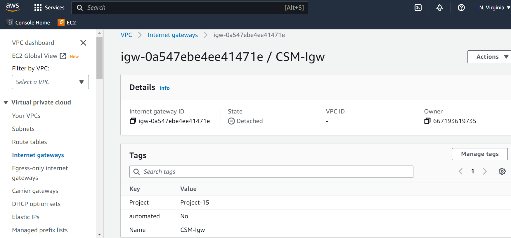
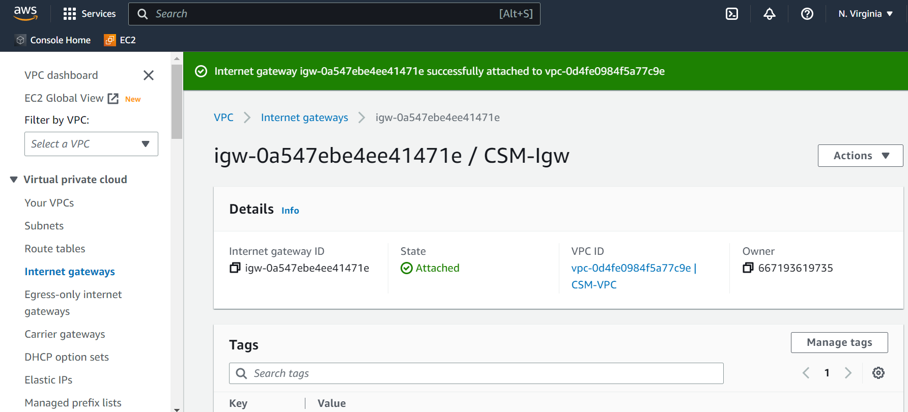

# Project-15-AWS-Cloud-Solution-For-2-Company

Project 15 AWS Cloud Solution For 2 Company Websites Using A Reverse Proxy Technology

## Starting Off the AWS Cloud Project

1- Properly configure your AWS account and Organization Unit

- Create an AWS Master account. (Also known as Root Account)
  
- Within the Root account, create a sub-account and name it DevOps. (You will need another email address to complete this)
  
  

- Within the Root account, create an AWS Organization Unit (OU). Name it Dev. (We will launch Dev resources in there)
  

- Move the DevOps account into the Dev OU.
  
  

- Login to the newly created AWS account using the new email address.
  
  Note: ** select `"Forgot Password"` to setup the new user password**

  

2- Create a free domain name for your fictitious company at Freenom domain registrar here.

3- Create a hosted zone in AWS, and map it to your free domain from Freenom. Watch how to do that here

**Set Up a Virtual Private Network (VPC)**

Always make reference to the architectural diagram and ensure that your configuration is aligned with it.

1. Create a `VPC`

Enable DNS hostnames

2. Create an `Internet Gateway`
Creating an internet Gateway and attache it to the VPC:

   
3. Create `subnets` as shown in the architecture
   
   

4. Create a route table and associate it with `public subnets`
   
5. Create a route table and associate it with `private subnets`

6. `Edit a route` in `public route table`, and associate it with the `Internet Gateway`. (This is what allows a public subnet to be accisble from the Internet)

7. Create `3 Elastic IPs`

8. Create a `Nat Gateway` and assign one of the Elastic IPs (*The other 2 will be used by Bastion hosts)

9.  Create a Security Group for:

- `Nginx Servers`: Access to Nginx should only be allowed from a Application Load balancer (ALB). At this point, we have not created a load balancer, therefore we will update the rules later. For now, just create it and put some dummy records as a place holder.
  
- `Bastion Servers`: Access to the Bastion servers should be allowed only from workstations that need to `SSH` into the bastion servers. Hence, you can use your workstation `public IP address`. To get this information, simply go to your terminal and type `curl www.canhazip.com`
  
- `Application Load Balancer`: `ALB` will be available from the Internet
  
- `Webservers`: Access to Webservers should only be allowed from the `Nginx servers`. 
  
- `Data Layer`: Access to the Data layer, which is comprised of Amazon `Relational Database Service (RDS)` and Amazon `Elastic File System (EFS)` must be carefully desinged – only `webservers` should be able to connect to `RDS`, while `Nginx` and `Webservers` will have access to `EFS Mountpoint`.

